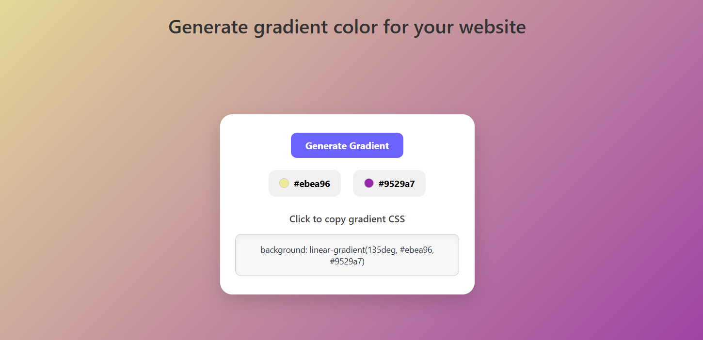

# 🎨 Gradient Color Generator

A beautiful and interactive gradient background color generator built with HTML, CSS, and JavaScript. This web tool lets users generate random two-color gradients for their websites and easily copy the CSS code to use in their own projects.

## 🚀 Features

- 🎛️ Click a button to generate a new random gradient.
- 🟢 Individually change the start and end colors of the gradient.
- 📋 Click on the CSS code to **copy** it to clipboard.
- 💡 Tooltip feedback when CSS is copied.
- 💻 Responsive and clean UI design.

## 🔗 Live Demo

🌐 [View Live Project](https://nabin2002.github.io/Gradient-Color-Generator/)


## 📸 Screenshot
#### 🖼️ UI


## 🧰 Technologies Used

- **HTML5** – Structure
- **CSS3** – Styling and layout
- **JavaScript (Vanilla)** – Functionality and interactivity

## 📂 Folder Structure

```bash
Gradient-Color-Generator/
├── index.html
├── style.css          # (Optional if CSS is external)
├── script.js          # (Optional if JS is external)
├── assets/
│   └── screenshot1.png
└── README.md
```

## ✨ How to Use

#### 1. Clone this repository
```bash
git clone https://github.com/your-username/gradient-color-generator.git
```
#### 2. Open index.html in your browser.

#### 3. Click the "Generate Gradient" button to see new gradients.

#### 4. Click on either color to randomize only one end of the gradient.

#### 5. Click on the gradient code box to copy the CSS code for use.


## 📎 Sample Gradient CSS
```bash
background: linear-gradient(135deg, #a8edea, #fed6e3);
```

## 🙌 Author
#### Nabin Chandra Roy